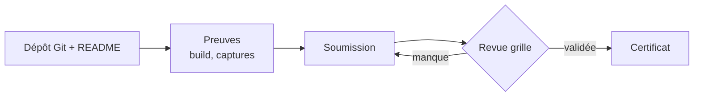

## Les deux voies de validation
Publier réellement demande un compte payant. Pour que le certificat reste accessible, deux voies valident **à l'identique**.

### Voie A — Build prêt + plan
Une app complète, un build de production réel (`.aab` gratuit) et un plan de publication documenté.

### Voie B — Publiée pour de vrai
La même app, réellement publiée sur au moins un store (Google Play le plus accessible).

---

### Soumettre et obtenir le certificat

---

## Cadrage MVP — mini cahier des charges

Avant de coder, remplissez ce cadre pour définir précisément votre MVP.

- **Projet :** ‹nom›
- **Problème :** ‹le besoin concret, en une phrase›
- **Utilisateur cible :** ‹pour qui›
- **Fonctionnalité cœur (MVP) :** ‹la seule indispensable›`
- **Fonctionnalités secondaires :** ‹bonus, après le MVP›
- **Hors périmètre :** ‹ce que l'app ne fera PAS› — le plus important
- **Stack :** Expo + ‹Supabase ? capteurs ? notifications ?›

## Grille de compétences

| Domaine                 | Attendu                                          |
| ----------------------- | ------------------------------------------------ |
| **Cadrage**             | Un MVP clair, un périmètre assumé (m.14)         |
| **Navigation & écrans** | Plusieurs écrans, navigation cohérente (m.1-2)   |
| **État & données**      | État géré + persistance ou backend (m.3-5)       |
| **Une brique avancée**  | Auth, capteurs, notifications ou offline (m.6-9) |
| **Finition**            | UI cohérente + quelques tests (m.10, 12)         |
| **Livraison**           | Build de production + voie A ou B (m.11)         |
| **Monétisation**        | Une stratégie décidée, même « gratuit » (m.13)   |
| **Présentation**        | README + fiche portfolio (m.14)                  |

---

## À vous de jouer — le défi final

Concevoir, coder, documenter et publier **votre** app Expo, et décrocher le certificat.

1. Cadrez votre idée et livrez le **MVP** fonctionnel
2. Couvrez la **grille de compétences** (les bonnes briques, proprement)
3. Produisez un **build de production**, choisissez votre voie : A (build + plan) ou B (publiée)
4. Documentez : **README + fiche portfolio + pitch**
5. **Soumettez** votre projet pour revue, corrigez si besoin, décrochez votre **certificat**
