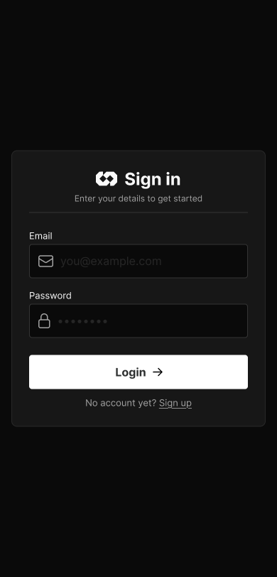
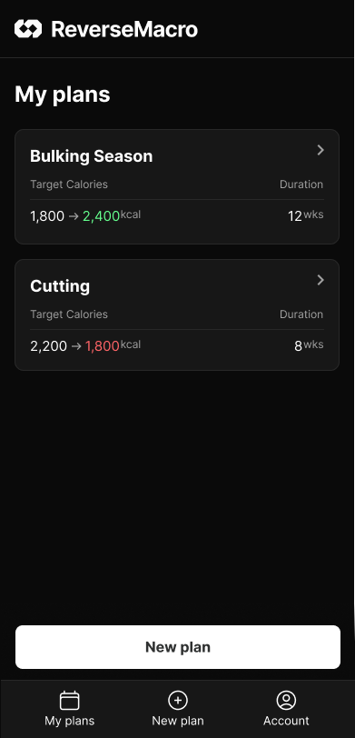
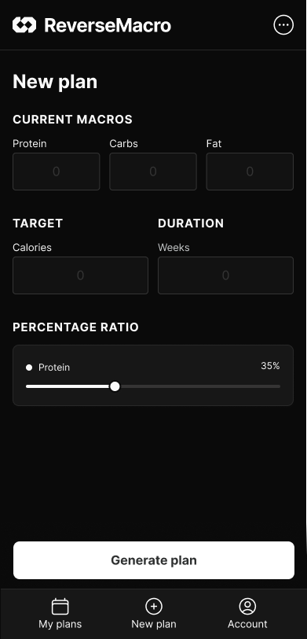
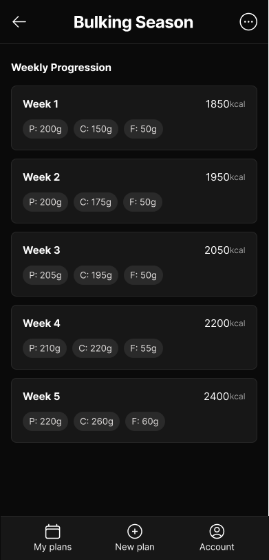
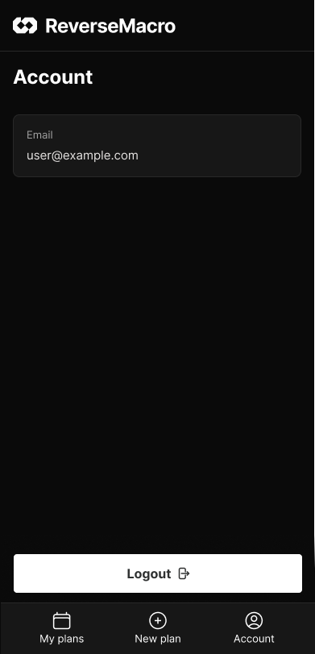

# Fiche portfolio — ReverseMacro

> Planificateur de reverse diet mobile · Expo + Supabase

---

## En une phrase

**ReverseMacro** transforme trois informations — macros actuelles, cible calorique, durée — en un plan de reverse diet progressif, semaine par semaine, jusqu'à l'objectif calorique.

## En bref

| | |
|---|---|
| **Type** | Application mobile (iOS / Android) |
| **Domaine** | Fitness / nutrition |
| **Rôle** | Conception, développement et livraison (bout en bout) |
| **Stack** | Expo (React Native) · Expo Router · Supabase · TanStack Query · Drizzle · NativeWind |
| **Statut** | MVP fonctionnel · build de production `.aab` (Voie A) |
| **Durée** | Projet de certification |

---

## Le problème

Changer d'objectif physique impose d'adapter sa diète. Le faire sans choquer l'organisme demande un ajustement **progressif et calculé** des apports — ce que la plupart des gens font approximativement, sans plan défini. Le public visé (athlètes, pratiquants de musculation, personnes en régime) manque d'un outil simple pour **planifier** cette montée.

## La solution

Un générateur de plan qui, à partir d'un point de départ, d'une cible et d'une durée, produit un tableau hebdomadaire des quotas journaliers (kcal + protéines / glucides / lipides). Les calories montent **linéairement** vers l'objectif ; les protéines sont tenues à un ratio réglable ; le reste se répartit en préservant l'équilibre glucides/lipides de départ.

Choix de périmètre fort et **assumé** : l'app *génère* un plan, elle ne *journalise pas* les repas. Ce cadrage garde le MVP focalisé et livrable.

---

## Fonctionnalités clés

- 🎯 **Génération de plan** hebdomadaire progressif (cœur du MVP).
- 👤 **Comptes utilisateurs** (auth email / mot de passe, Supabase).
- 💾 **Plans multiples** par compte : créer, renommer, modifier, supprimer.
- 🎚️ **Répartition des macros réglable** (ratio protéines).
- 🔒 **Isolation des données** par utilisateur via RLS Postgres.
- 🌗 **Thème clair / sombre**.

---

## Points techniques marquants

- **Logique métier pure et testée** — le calcul du plan (`generateReversePlan`) est une fonction pure isolée de l'UI, la source unique de vérité, couverte par des tests unitaires (cas nominal, bornes, ratios).
- **Persistance minimale et recalcul côté client** — la base ne stocke que **les paramètres** du plan ; le tableau détaillé est recalculé à l'ouverture. Zéro donnée dérivée en base, zéro risque de désynchronisation.
- **Architecture en couches** — accès données (`PlansService`) → cache serveur (React Query) → écrans. Séparation nette des responsabilités.
- **Sécurité par défaut** — Row-Level Security activée, chaque politique scopant les lignes à `auth.uid()`. L'app n'utilise que la clé anon ; le secret Postgres reste côté outillage.
- **Schéma versionné** — Drizzle ORM ; migrations générées et appliquées proprement (jamais `push`, qui casserait les politiques RLS).

---

## Compétences démontrées

| Domaine | Preuve dans ReverseMacro |
|---|---|
| **Cadrage** | MVP clair, périmètre assumé (pas de journal quotidien) — [scope.md](scope.md) |
| **Navigation & écrans** | Zone Auth + 4 écrans app (Expo Router, typed routes) |
| **État & données** | Session (Context) + plans (TanStack Query) + persistance Supabase |
| **Brique avancée** | Auth + backend Supabase avec RLS |
| **Finition** | UI cohérente (design system) + 26 tests unitaires |
| **Livraison** | Build de production `.aab` + plan de publication (Voie A) |
| **Monétisation** | Gratuit assumé ; piste offre pro (plans illimités) |
| **Présentation** | README + cette fiche + pitch |

---

## Résultat

MVP fonctionnel couvrant l'intégralité de la grille de compétences, livré avec un **build de production `.aab`** (EAS Build) et un **plan de publication documenté** décrivant la mise en ligne Google Play (Voie A).

---

## Captures d'écran

> _À insérer :_ Connexion · Mes plans · Nouveau plan · Détail (tableau semaine par semaine) · Compte.

| | | |
|---|---|---|
|  |  |  |
|  |  | |

---

## Liens

- **Dépôt :** _‹URL du repo›_
- **Cahier des charges :** [scope.md](scope.md)
- **Plan de publication :** [publication-plan.md](publication-plan.md)
- **Pitch :** [pitch.md](pitch.md)
